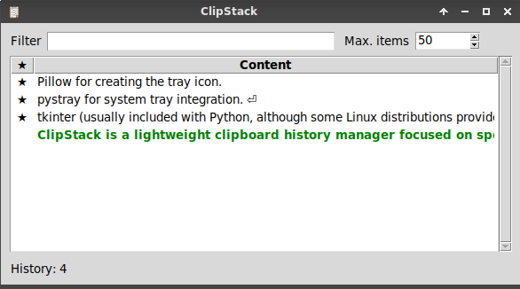

# ClipStack
 
ClipStack is a lightweight clipboard history manager focused on speed, simplicity and keyboard-driven workflows.

It continuously monitors the system clipboard, stores a configurable history of text clips, and provides fast access through real-time filtering. Frequently used clips can be pinned to prevent automatic removal, and the complete history can be imported or exported for reuse.

ClipStack is designed to stay out of the way: it can run from the system tray when available, or provide the same functionality through its window menu on desktop environments without tray menu support.

## Features

- Clipboard history.
- Filter as you type.
- Pin frequently used entries.
- Edit stored clips.
- Import and export clipboard history.
- Automatic persistence.
- System tray integration.
- Window menu fallback for desktops without tray support.
- Multilingual interface.

## Screenshot



## Requirements

ClipStack requires **Python 3** and the following libraries:

* **tkinter** (usually included with Python, although some Linux distributions provide it as a separate package).
* **pystray** for system tray integration.
* **Pillow** for creating the tray icon.

The required Python packages can be installed with:

```bash
pip install pystray pillow
```

If `tkinter` is not available, install the corresponding package provided by your operating system.

## Launching the application

Start ClipStack from a terminal with:

```bash
python3 clipstack.py
```

By default, ClipStack uses the system tray when it is available.

The optional `--no-tray` parameter disables tray integration and enables the application window menu instead:

```bash
python3 clipstack.py --no-tray
```

Use this option on desktop environments that do not support tray menus, or if you prefer to access all commands from the application window.

## Data storage

On its first execution, ClipStack automatically creates the file `.clipstack_history.json` in the user's home directory. No manual setup is required.

Clipboard history and application settings are saved automatically whenever they change, preserving pinned items, timestamps and user preferences between sessions.

The **Export** and **Import** commands allow the clipboard history to be saved to or restored from an external JSON file. Exported files contain only the clipboard history (including pinned items and timestamps); application settings are not exported.

## History list

Each entry shows:

- A ★ icon for pinned items.
- An optional timestamp.
- A one-line preview of the clipboard contents.

The entry currently stored in the system clipboard is highlighted in green and bold.

## Clipboard entry menu

Each clipboard entry provides its own context menu, available by right-clicking the item. Most actions are also available through their associated keyboard shortcuts. Double-clicking an item copies it to the system clipboard. If the **Hide when copy** option is enabled in the Configuration menu, the application window is also hidden.

Clicking the **pin** column toggles the pinned state of an item without opening the context menu.

### Copy / Copy and hide *(Enter)*
  Copy the selected item to the system clipboard.

### Pin / Unpin *(F2)*  
  Pin or unpin the selected item.

### Edit *(Ctrl+E)*  
  Edit the selected item text.

### Delete *(Del)*  
  Remove the selected item.

The **Copy** entry changes to **Copy and hide** when the **Hide when copy** option is enabled in the Configuration menu.

## Main menu

The first two entries are only available from the system tray menu. When ClipStack is started with `--no-tray`, or when the desktop environment does not provide tray menus, the application remains accessible through the application window menu instead.

### Show

Restore the ClipStack window.

### Hide *(Esc)*

Hide the window while keeping ClipStack running in the background.

The remaining menu entries are available from both the system tray menu and the application window menu.

### File

- **Import** *(Ctrl+L)*  
  Load clipboard history from an external file.

- **Export** *(Ctrl+S)*  
  Save the current clipboard history to an external file.

### Clear

- **Unpinned** *(Ctrl+Shift+U)*  
  Remove all unpinned items.

- **All** *(Ctrl+Shift+A)*  
  Remove all items.

- **Not matching filter** *(Ctrl+Shift+N)*  
  When a filter is active, remove all items that do not match it.

### Configuration

- **Autocapture**  
  Enable or disable automatic clipboard monitoring.

- **Show timestamp** *(Ctrl+T)*  
  Show or hide timestamps in the history list.

- **Hide when copy** *(F6)*  
  Automatically hide the window after copying an item to the clipboard (tray mode only).

- **Window position**  
  Select the screen corner where the window is displayed.

- **Language**  
  Select the application language.

### Exit

Exit the application.

## Keyboard shortcuts

| Shortcut | Action |
|----------|--------|
| Enter | Copy the selected item |
| Ctrl+E | Edit the selected item |
| F2 | Pin / Unpin the selected item |
| Del | Delete the selected item |
| Esc | Hide the window *(tray mode only)* |
| Ctrl+L | Import clipboard history |
| Ctrl+S | Export clipboard history |
| Ctrl+T | Show / Hide timestamps |
| Ctrl+Shift+A | Clear all items |
| Ctrl+Shift+N | Clear items not matching the current filter |
| Ctrl+Shift+U | Clear unpinned items |
| F6 | Toggle **Hide when copy** |

## Localization

ClipStack currently supports English and Spanish.

The localization system is designed to be easily extended. Contributions adding support for additional languages are always welcome.

## Limitations

- Only text clipboard entries are stored. Images and other clipboard formats are ignored.
- Clipboard monitoring is limited to the local user session.
- Clipboard contents copied from ClipStack may not persist after closing the application, depending on the desktop environment and clipboard backend.

## Acknowledgements

Thanks to everyone who tested ClipStack and provided feedback, bug reports and feature suggestions.

Special thanks to my daughter, Pink Scratchy 314, for designing the ClipStack icon.

## License

ClipStack is free software released under the GNU General Public License v3.0 (GPL-3.0). See the `LICENSE` file for the complete license text.
